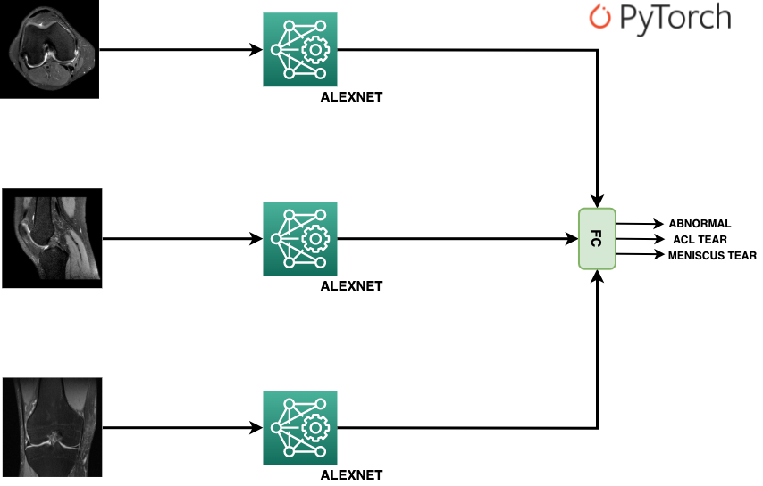
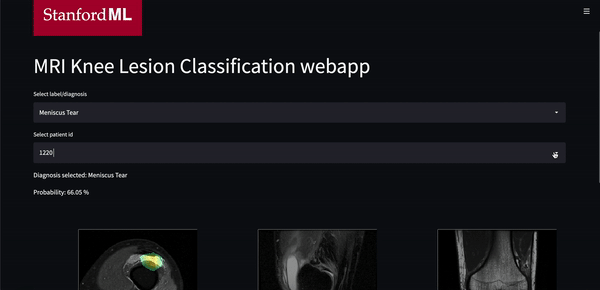

# Knee-Lesions-Classification-via-Deep-Learning
Knee Lesions Classification via Deep Learning Techniques (MRNet model)

# Summary
The main purpose of this project is training and deploy a Deep Learning model for knee lesions detection:

* Anterior Cruciate Ligament tear or ACL Tear
* Meniscus Tear
* Another abnormalities or "Abnormal"

# Data
Training and validation data were extracted from [Stanford Machine Learning Group Repository](https://stanfordmlgroup.github.io/competitions/mrnet/):
* Train data: contains 1130 .npy files
* Validation data: contains 120 .npy files

# Model architecture
In a nutshell, the architecture consists of three-pretrained AlexNet models using PyTorch (only the convolutional part is selected). Convolutional outputs are concatenated into a Fully Conected layer (FC) to get the probability of each lesion (sigmoid function):




# Training and validation results

| Train acc. | Validation acc. | Abnormal sens. | Abnormal spec. | ACL sens. | ACL spec. | Meniscus sens. | Meniscus spec. |
|------------|-----------------|----------------|----------------|-----------|-----------|----------------|----------------|
| 0.7991     | 0.7972          | 0.9053         | 0.72           | 0.8939    | 0.7037    | 0.6923         | 0.7353         |

# GitHub content
Table of Contents
=================
   * main.py: python main file for webapp execution
   * utils.py: python file which contains application corpus such as constants, functions and MRNet class (deep learning architecture)
   * train.ipynb: python notebook for model training (trained on Google Colab - GPU)
   * val data: folder with few samples of MRI validation data

# Web application
The final web application for model deployment was built using streamlit library (Python). To deploy the app, you must run the following line in your command line or cmd:

```
streamlit run main.py
```


# References
[Stanford Machine Learning Repository](https://stanfordmlgroup.github.io/competitions/mrnet/)

[Deep-learning-assisted diagnosis for knee magnetic resonance imaging: Development and retrospective validation of MRNet / Plos Medicine Journal](https://journals.plos.org/plosmedicine/article?id=10.1371/journal.pmed.1002699)

[Stanford MRNet Challenge: Classifying Knee MRIs](https://learnopencv.com/stanford-mrnet-challenge-classifying-knee-mris/)

[Triple MRNet Architecture sample](https://github.com/yashbhalgat/MRNet-Competition)

[Implemented Grad-CAM in PyTorch for VGG16 Network](https://medium.com/@stepanulyanin/implementing-grad-cam-in-pytorch-ea0937c31e82)

[Streamlit library](https://streamlit.io/)


